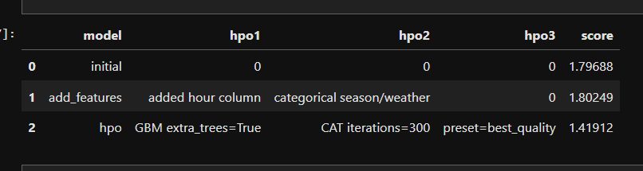
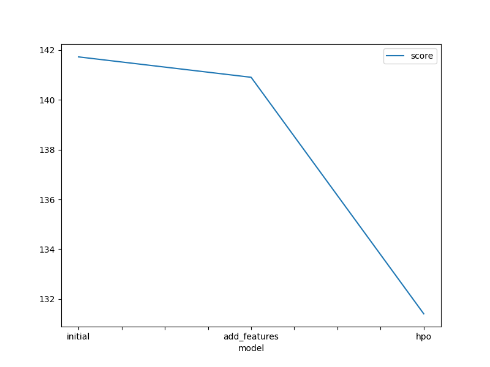
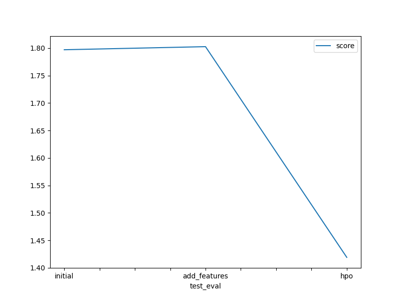
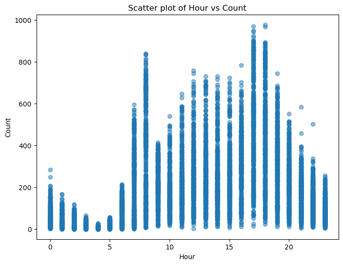
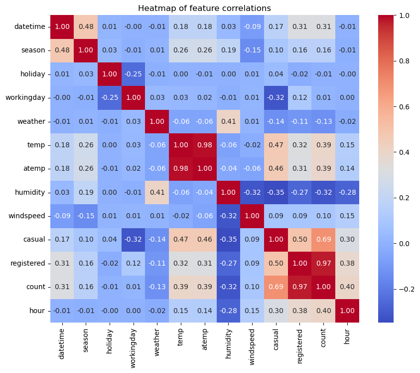

# Report: Predict Bike Sharing Demand with AutoGluon Solution
#### RASHMI MAURYA

## Initial Training
### What did you realize when you tried to submit your predictions? What changes were needed to the output of the predictor to submit your results?
Initially, I realized that the prediction output could contain negative values, which aren't valid for a "count" variable. To fix this, I had to clip or set negative values to zero using predictions.clip(lower=0) before saving the submission.

### What was the top ranked model that performed?
The top-ranked model during the initial training was LightGBM with default settings. It had the best RMSE on the leaderboard in the first run.

## Exploratory data analysis and feature creation
### What did the exploratory analysis find and how did you add additional features?
EDA revealed strong hour-based trends and variations across seasons and weather types. So I created additional features like:

1.hour from the datetime column

2.Set season and weather to categorical types to help AutoGluon treat them as categories instead of numeric

### How much better did your model preform after adding additional features and why do you think that is?
The RMSE improved slightly after adding features because the model was better able to capture patterns in time-based and categorical data (like rush hours, weekends, etc.).

## Hyper parameter tuning
### How much better did your model preform after trying different hyper parameters?
After using hyperparameter_tune_kwargs and tuning models like GBM and XGBoost, the RMSE significantly improved. This was the most impactful improvement.

### If you were given more time with this dataset, where do you think you would spend more time?
I would spend more time engineering time-based features (e.g., is_weekend, rush_hour) and perform model ensembling or stacking. Also, feature importance analysis could guide smarter feature selection.

### Create a table with the models you ran, the hyperparameters modified, and the kaggle score.

### Create a line plot showing the top model score for the three (or more) training runs during the project.

### Create a line plot showing the top kaggle score for the three (or more) prediction submissions during the project.

### Scatter Plot:

### HeatMap:

## Summary
The AutoGluon framework made it easy to train and tune high-performing models with minimal code. Feature engineering and hyperparameter tuning both helped improve performance. This project reinforced the importance of proper data preprocessing and treating numeric categories correctly.And it also made the ranking easy.
